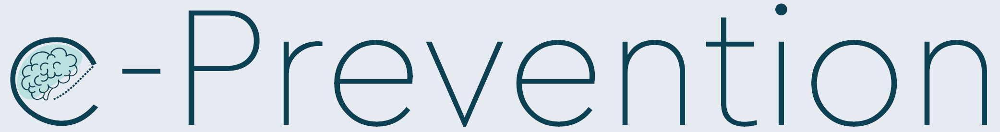

## SPGC ICASSP 2024 Baselines

<div align="center">


</div>
<br/>

This repository holds the source code for the baselines of the `The 2nd e-Prevention challenge: Psychotic and Non-Psychotic Relapse Detection using Wearable-Based Digital Phenotyping` organized in context of [ICASSP 2024](https://2024.ieeeicassp.org/). The Challenge website can be found in [https://robotics.ntua.gr/icassp2024-eprevention-spgc/](https://robotics.ntua.gr/icassp2024-eprevention-spgc/).


### Tracks
Participants will be evaluated on their ability to use this data to extract digital phenotypes that can effectively quantify behavioral patterns and traits. This will be assessed across two distinct tasks: 

1. Unsupervised Detection of non-psychotic relapses
2. Unsupervised Detection of psychotic relapses


### Dataset Description
The dataset for each track has the following format:

```
├── data
│   ├── track{1,2}
│   │   ├── patient1
│   │   │   ├── train_0 # training data sequence #0 for patient #1
│   │   │   |   ├── linacc.parquet
│   │   │   |   ├── gyr.parquet
│   │   │   |   ├── hrm.parquet
│   │   │   |   ├── sleep.parquet
│   │   │   |   ├── step.parquet
│   │   │   |   ├── relapses.csv
│   │   │   ├── train_1 # training data sequence #1 for patient #1
│   │   │   ├── ...
│   │   │   ├── val_0 # validation data sequence #0 patient #1
│   │   │   ├── ...
│   │   │   ├── test_0 # test data sequence #0 patient #1
│   │   │   ├── ...
│   │   ├── patient2
```

For each patient and split we provide multiple sequences of several contiguous days of raw data from the accelerometer, gyroscope, heart rate monitor, sleeping information, and walking information. We use the apache parquet format for storing the raw data. Each .parquet file includes a dataframe with the following format:

| measurement#1 | measurement#2 | time            | day_index |
|-----------|------------|-----------------|-----------|
| 81        | 721        | 00:00:00.050896 | 0         |
| 82        | 500        | 00:00:00.251049 | 0         |
| 58        | 200        | 00:00:00.452389 | 1         |
| 48        | 300        | 00:00:00.651574 | 1         |
| 32        | 50        | 00:00:00.853641 | 2         |

where `measurement#1`, `measurement#2`, ..., `measurement#N` are measurement extracted from the corresponding sensor, `time` is the time of the day, and `day_index` is the day index of the measurement. Each different folder (e.g., train_0, train_1, val_0, val_1, etc.) include a large contiguous temporal segment of many days of data. 

Specifically for the `steps.parquet` we have the following format:

| totalSteps | stepsWalking | stepsRunning | distance  | calories | start_time | end_time | start_date_index | end_date_index |
|------------|--------------|--------------|-----------|----------|------------|----------|------------------|----------------|
| 15         | 15           | 0            | 11.040000 | 0.75     | 06:55:01   | 07:08:58 | 0               | 0             |
| 32         | 32           | 0            | 22.559999 | 1.54     | 07:35:01   | 07:36:08 | 1               | 1             |
| 20         | 20           | 0            | 11.130000 | 0.87     | 07:36:58   | 07:37:41 | 1               | 1             |


where each row denotes a segment (one day can have multiple segments) during which the user was walking, starting at `start_time` and ending at `end_time` of the corresponding day (denoted by `start_date_index` and `end_date_index`).

Similarly for sleep.parquet:

| start_time        | end_time          | start_date_index | end_date_index |
|-------------------|-------------------|------------------|----------------|
| 22:55:10.309725   | 02:36:19.321286   | -1               | 0              |
| 00:52:20.897339   | 07:14:36.473329   | 1                | 1              |
| 22:10:27.643084   | 02:24:38.018029   | 1                | 2              |
| 04:04:42.087880   | 07:14:49.845844   | 2                | 2              |

where each row denotes a segment (one day can have multiple segments) during which the user was sleeping, starting at `start_time` and ending at `end_time` of the corresponding day (denoted by `start_date_index` and `end_date_index`).

The `relapses.csv` file includes the relapse information for the corresponding patient and split. The format of the `relapses.csv` file is the following:

| relapse? | day_index |
|-------------------|-----------|
| 0                 | 0         |
| 1                 | 1         |
| 0                 | 2         |
| 1                 | 3         |
| 0                 | 4         |
| ...               | ...       |

where `relapse?` is a binary variable indicating whether the patient is on a relapse state on the corresponding day and `day_index` is the day index of the measurement. 

Notes:

1. There is the possibility that for some days we did not have any data (e.g., the day_index in the corresponding dataframe is missing). In this case, the participants must also predict the relapse state of the patient for this day and include it in their submission.
2. Participants are allowed to send multiple submissions (up to 5), however from each team we will evaluate only the last two sent.
3. Each submission must be accompanied with a short (up to 1 page) description of the proposed system and methodology.
4. Participants are allowed to use validation data and relapse annotations only for evaluating their solutions and not for training their models. We will only accept unsupervised methods (regarding the relapse annotations) for the challenge.

#### Submission
We expect the participants to send us multiple .csv files with the following format:

| score | day_index |
|-------------------|-----------|
| 0.2                 | 0         |
| 0.9                 | 1         |
| 0.3                 | 2         |
| 0.5                 | 3         |
| 0.7                 | 4         |
| ...               | ...       |

in the following directory structure:


```
├── submission
│   ├── track{1,2}
│   │   ├── patient1
│   │   │   ├── test_0 
│   │   │   |   ├── submission.csv
│   │   │   ├── test_1
│   │   │   |   ├── submission.csv
│   │   │   ├── ...
│   │   ├── patient2
```

#### Metrics
For both tracks, the evaluation of the state of the patient as stable or relapsing will be carried out on a daily basis. Since this is an anomaly detection task, the average of the PR-AUC and ROC-AUC scores over the daily predictions will be utilized as the final evaluation metrics. Participants can evaluate the effectiveness of their approach using the same metrics on the validation set. 

This repository holds the code needed to evaluate the solution. Note that the PR-AUC, ROC-AUC scores will be macro-averaged. This means that we will first calculate the PR-AUC, ROC-AUC scores for each patient and then average them. The formula is:

```
PR-AUC = 1 / N * sum_{i=1}^N PR-AUC_i
ROC-AUC = 1 / N * sum_{i=1}^N ROC-AUC_i
AVG = (PR-AUC + ROC-AUC) / 2
```

where `N` is the number of patients in the dataset.


### Usage
To register for the challenge, participants are required to send an e-mail to the below contacts with the team name, the names of their team members, as well as their emails and affiliations.

- **P. P. Filntisis**, School of ECE (CVSP / IRAL Group), National Technical Univ. of Athens, [filby@central.ntua.gr](mailto:filby@central.ntua.gr)

- **N. Efthymiou**, School of ECE (CVSP / IRAL Group), National Technical Univ. of Athens, [nefthymiou@central.ntua.gr](mailto:nefthymiou@central.ntua.gr)

### Baseline Description
First we extract the following features from the raw data using a 5-mins window:

* RR-Interval RMSSD
* RR-Interval SDNN
* RR-Interval Mean
* HeartRate Mean
* RR-Interval Lomb-Scargle Power in High Frequency Band
* Accelerometer norm

and also add time encoding of the corresponding time of the day using cosine and sine functions. Then we train a Transformer Encoder on these features that learns to classify the identity of the user from a window of 32 samples. We consider each day in the dataset independently (no temporal modeling across multiple days).

In order to perform the relapse detection task in an unsupervised way (anomaly detection) we then extract features from the training set using the penultimate layer of the trained Transformer Encoder and train a one-class SVM on these features. 

At validation/test time the trained SVM is used to score features extracted from multiple windows for each day in the val/test dataset, the scores are averaged per day and then the average score is used to classify the day as relapse or not.


### Running the baselines
#### Installation
Create a new conda environment:

```bash
conda create -n spgc python=3.9
conda activate spgc
```

next, install the requirements:

```bash
pip install -r requirements.txt
```


#### Feature extraction
To extract the features from the raw data for track1 run the following command:

```bash
python extract_features.py --dataset_path data/track1/ --out_features_path data/track1_features/
```

and for track2 run:

```bash
python extract_features.py --dataset_path data/track2/ --out_features_path data/track2_features/
```


#### Train the Transformer Encoder classifier
To train the Transformer Encoder classifier for track1 run the following command:

```bash
python train.py --num_patients 9 --window_size 24 --save_path track1_win24_l2_d64 --features_path data/track1_features/ --dataset_path data/track1/ --d_model 64 --nlayers 2
```

and for track 2 run:

```bash
python train.py --optimizer Adam --learning_rate 1e-3 --window_size 32 --num_patients 10 --save_path checkpoints_track2
```

During training the model also at each epoch trains the OneClassSVMs and outputs metrics for the validation set. Note that the validation metrics here do not correspond to the official metrics of the challenge (because we ignore days with limited/missing data), but are used only for finding the best model which will be used subsequently for testing and creating the submission.

#### Find anomalies
To find the anomalies for track1 and create a submission file run the following command:

```bash
python test.py 
```

you can also use the validation set in order to calculate the official performance of the model (taking into account all days):

```bash

```

### References

```
@article{zlatintsi2022prevention,
  title={E-prevention: Advanced support system for monitoring and relapse prevention in patients with psychotic disorders analyzing long-term multimodal data from wearables and video captures},
  author={Zlatintsi, Athanasia and Filntisis, Panagiotis P and Garoufis, Christos and Efthymiou, Niki and Maragos, Petros and Menychtas, Andreas and Maglogiannis, Ilias and Tsanakas, Panayiotis and Sounapoglou, Thomas and Kalisperakis, Emmanouil and others},
  journal={Sensors},
  volume={22},
  year={2022},
}

@inproceedings{retsinas2020person,
  title={Person identification using deep convolutional neural networks on short-term signals from wearable sensors},
  author={Retsinas, George and Filntisis, Panayiotis Paraskevas and Efthymiou, Niki and Theodosis, Emmanouil and Zlatintsi, Athanasia and Maragos, Petros},
  booktitle={ICASSP 2020-2020 IEEE International Conference on Acoustics, Speech and Signal Processing (ICASSP)},
  year={2020},
}

@inproceedings{panagiotou2022comparative,
  title={A comparative study of autoencoder architectures for mental health analysis using wearable sensors data},
  author={Panagiotou, M and Zlatintsi, A and Filntisis, PP and Roumeliotis, AJ and Efthymiou, N and Maragos, P},
  booktitle={2022 30th European Signal Processing Conference (EUSIPCO)},
  year={2022},
}


@article{efthymioudigital,
  title={From Digital Phenotype Identification To Detection Of Psychotic Relapses},
  author={Efthymiou, Niki and Retsinas, George and Filntisis, Panagiotis P and Garoufis, Christos and Zlatintsi, Athanasia and Kalisperakis, Emmanouil and Garyfalli, Vasiliki and Karantinos, Thomas and Lazaridi, Marina and Smyrnis, Nikolaos and Maragos, Petros}
  booktitle={2023 IEEE International Conference on Health Informatics (ICHI)},
 year={2023},
}
```


### Rules, Requirements and Licensing

Participating teams are allowed to compete in any or both tracks; however, all participants should not be included in more than one team. Αfter the completion of the challenge, the top-scoring teams for each track will be declared the winners of their respective track. Furthermore, the top-5 performing teams will be required to provide a synopsis of their proposed methodology and results in a two-page paper and present it in person to the Special Session dedicated to this challenge at the ICASSP-2024 conference.

Permission is granted to use the data, given that you agree: 1. To include a reference to the e-Prevention Dataset in any work that makes use of the dataset. For research papers, cite our preferred publication as it will be listed on our website and our challenge overview paper (to be released later); for other media, cite our preferred publication as it will be listed on our website. 2. That you do not distribute this dataset or modified versions. 3. That you may not use the dataset or any derivative work for commercial purposes, such as, for example, licensing or selling the data or using the data with the purpose of procuring a commercial gain. 4. That all rights not expressly granted to you are reserved by the e-Prevention SP Grand Challenge 2024 organizers.


### Organizing Team
P. P. Filntisis<sup>1</sup>, N. Efthymiou<sup>1</sup>, G. Retsinas<sup>1</sup>, A. Zlatintsi<sup>1</sup>, C. Garoufis<sup>1</sup>, T. Sounapoglou<sup>2</sup>, P. Tsanakas<sup>1</sup>, N. Smyrnis<sup>3</sup>, and P. Maragos<sup>1</sup>

<sup>1</sup> School of ECE (CVSP / IRAL Group), National Technical University of Athens, Athens, Greece  
<sup>2</sup> BLOCKACHAIN PC, Thessaloniki, Greece  
<sup>3</sup> National & Kapodistrian University of Athens, Medical School, Athens, Greece


### Acknowledgements
Funding: This research has been financed by the European Regional Development Fund of the European Union and Greek national funds through the Operational Program Competitiveness, Entrepreneurship and Innovation, under the call RESEARCH–CREATE–INNOVATE (project acronym: e-Prevention, code: T1EDK-02890/MIS: 5032797).

This repository has borrowed code from the winning solution of the second track of the 1st e-Prevention Challenge which can be found [here](https://github.com/perceivelab/e-prevention-icassp-2023).